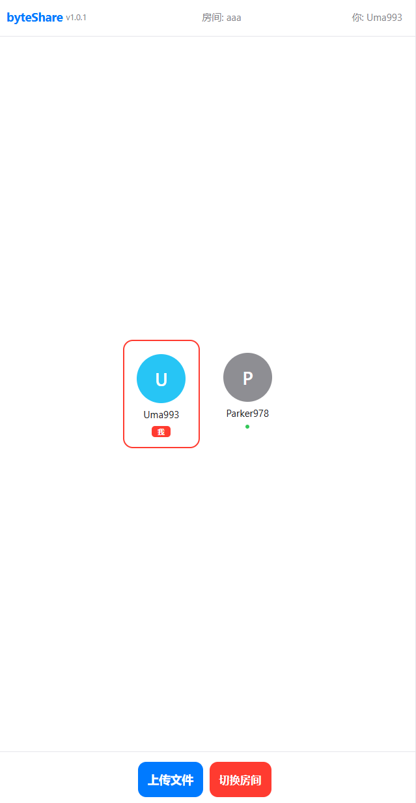
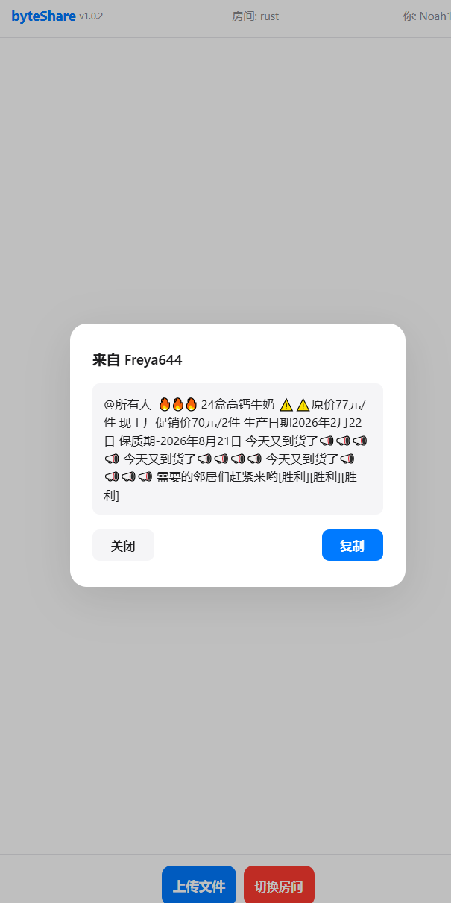
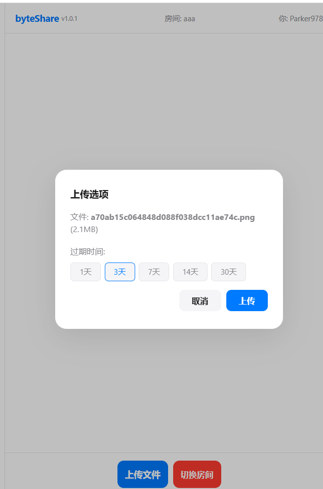

# byteShare

一个基于 Go 的实时点对点文件共享系统。在同一个虚拟房间内，用户之间可以直接传输文件和发送文字消息，也支持上传文件到服务器生成分享链接。

> 本项目由 AI AGENT 开发





## 功能

- **房间机制** — 房间名即路径，例如 `/abc?pwd=xxx` 进入房间 abc，默认房间 index
- **P2P 文件传输** — 点击用户头像，选择文件直接发送，通过 WebSocket 分片传输
- **实时进度环** — 传输时双方头像显示同步进度边框
- **断线重传** — P2P 传输每片有 ACK 确认，超时自动重传（最多 5 次）
- **文字消息** — 右键（移动端长按）用户头像发送即时消息，接收时居中弹窗展示，一键复制全文
- **服务端文件上传** — 文件分片上传至服务器，生成带过期时间的下载链接
- **上传断点重试** — 服务端上传支持分片传输，每片最多重试 5 次
- **纯前端界面** — 无外部依赖，原生 HTML/CSS/JS，白色简洁风格
- **版本号展示** — 页面头部显示当前版本 v1.0.2
- **单二进制分发** — 所有静态资源通过 `embed` 编译进二进制文件
- **JSON 文件存储** — 文件记录存入本地 JSON 文件，无需外部数据库
- **自动发布** — 合并到 master 自动编译 4 平台二进制并创建 GitHub Release

## 快速开始

```bash
# 下载并编译
git clone https://github.com/del-xiong/byteShare.git
cd byteShare
go build -o byteShare .

# 编辑配置（设置密码）
vim config.yaml

# 运行
./byteShare

# 浏览器打开
open http://localhost:8080
```

## 使用方法

### 1. 登录

打开 `http://localhost:8080`，输入 `config.yaml` 中配置的密码即可进入。

### 2. 加入房间

- 默认路径 `/index?pwd=密码` 进入 index 房间
- 也可访问 `http://localhost:8080/房间名?pwd=密码` 直接进入指定房间
- 房间号会缓存到浏览器，下次自动加入同一房间
- 点击底部红色 **切换房间** 按钮可随时更换房间

### 3. P2P 文件传输

- **发送文件**：左键点击其他用户的头像 → 选择文件 → 对方收到接收提示
- **接收文件**：点击"接收"→ 文件通过 WebSocket 分片传输 → 保存到设备
- **传输过程**：底部显示进度条，双方头像显示同步进度环，支持断线重传（每片超时 3 秒自动重试，最多 5 次）

### 4. 文字消息

- **电脑端**：右键点击用户头像 → 输入消息 → Enter 发送
- **手机端**：长按用户头像 → 输入消息 → 发送
- **接收**：消息以居中弹窗展示，点击 **复制** 一键复制全部内容（超长内容自动滚动裁剪）

### 5. 服务端文件上传

- 点击底部 **上传文件** → 选择文件 → 设置过期时间（1~30 天）
- 文件自动分片（512KB/片）上传，每片失败自动重试最多 5 次
- 上传完成后弹出链接，点击 **复制** 一键复制下载地址
- 任何人打开该链接即可直接下载文件

## 配置说明

编辑 `config.yaml`：

```yaml
server:
  host: "0.0.0.0"       # 监听地址
  port: 8080             # 监听端口
  mode: "web"            # 运行模式
  public_url: ""         # 公开访问地址，留空则自动使用请求来源

auth:
  password: "你的密码"    # 登录密码

upload:
  dir: "./uploads"       # 上传文件存储目录
  max_size: 500          # 单个文件最大大小（MB）
  default_expiry: 3      # 默认过期天数
  max_expiry: 30         # 最大过期天数

database:
  path: "./fileshare.json"  # 数据库文件路径
```

## 项目结构

```
byteShare/
├── main.go               # 入口、HTTP 路由、嵌入资源
├── config/
│   └── config.go         # YAML 配置加载
├── model/
│   ├── models.go         # 包声明
│   └── store.go          # JSON 文件存储（上传记录）
├── utils/
│   ├── namegen.go        # 随机用户名生成
│   └── color.go          # 用户颜色生成
├── src/service/
│   ├── hub.go            # 房间和客户端管理
│   ├── client.go         # WebSocket 读写泵 + 消息路由
│   ├── auth.go           # 密码认证
│   └── upload.go         # 文件上传/下载（含分片）、过期清理
├── web/
│   ├── login.html        # 登录页
│   ├── index.html        # 主界面（含进度环 CSS）
│   └── js/app.js         # 前端逻辑（WebSocket、文件传输、UI）
├── static/
│   ├── 1.png             # 效果截图 - 登录页
│   ├── 2.png             # 效果截图 - 房间页
│   └── 3.png             # 效果截图 - 上传弹窗
├── .github/workflows/
│   └── build.yml         # CI: 编译 4 平台 + 自动发布 Release
├── config.yaml           # 默认配置文件
└── README.md
```

## 技术细节

- **WebSocket** — 使用 `gorilla/websocket` 实现实时通信，用于信令、文件分片传输和文字消息
- **P2P 分片传输** — 文件以 64KB 分片、base64 编码通过 WebSocket 传输；每片有 ACK 确认，超时 3 秒自动重传（最多 5 次）
- **服务端分片上传** — 文件以 512KB 分片上传至服务器，服务器端暂存分片，接收完毕后自动合并写入最终文件
- **进度环** — 使用 `conic-gradient` + `mask: radial-gradient` 在头像上呈现 3px 厚度的实时传输进度环
- **文字消息弹窗** — 接收文字消息时居中弹出模态框，内容区域 `max-height: 280px` 超长自动滚动，复制按钮复制完整内容
- **文件保存** — 接收端优先使用 File System Access API 保存文件，不支持时自动降级为 Blob 下载
- **数据库** — JSON 文件存储（无需外部数据库），使用 `gjson`/`sjson` 查询和修改
- **资源嵌入** — 前端 HTML/CSS/JS 通过 Go 的 `embed` 包编译进二进制文件
- **定时清理** — 后台每小时检查并删除过期文件及未完成的上传碎片
- **CI/CD** — 推送到 master 自动触发 GitHub Actions，编译 Linux/Windows (386/amd64) 并发布 Release

## License

MIT
